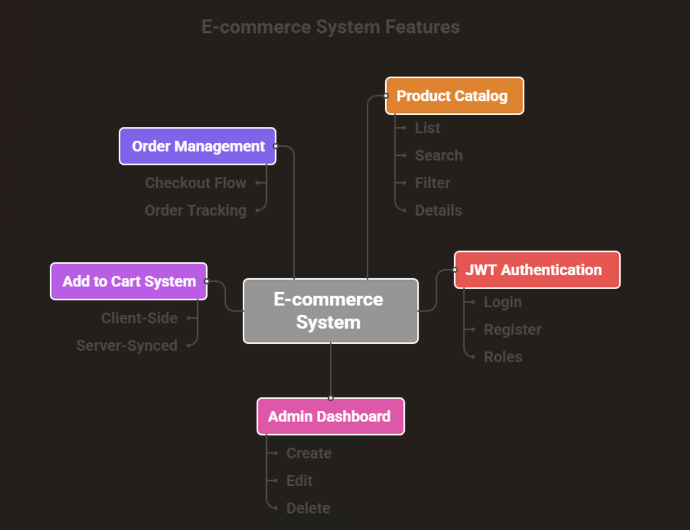

# E-commerce.backend

- [link to Frontend Repository](https://github.com/MamelAlbouryNdiaye/E-commerce.frontend)

# Hot Shop — Backend (MERN Stack)

This is the backend services of **Hot Shop**, an e-commerce web application built using the **MERN** stack.  
It exposes RESTful API endpoints to manage user authentication, product inventory, orders, and administrative operations.

---

## Features

### Authentication & Authorization
- JWT-based authentication
- Login & registration
- Protected routes
- Role-based access control (`admin` vs `user`)
- Password hashing using **bcrypt**

### Product Management
- Full CRUD operations
- Search and filtering by category
- Stock management
- Featured product support
- Image URLs support

### Orders (basic structure)
- Order creation
- Link between user and purchased products

### 🛒 Cart Compatibility
Backend architecture prepared for client-side cart persistence.

### Error Handling
- Centralized error middleware
- Clean JSON-based responses

---

##  Tech Stack

| Layer | Technology |
|--------|-------------|
| Runtime | Node.js |
| Framework | Express.js |
| Database | MongoDB / Mongoose |
| Security | bcrypt, JWT |
| Environment | dotenv |
| Dev Tools | nodemon, npm scripts |

---

## Project Structure

### Backend Architecture

### Frontend and Backend communication

